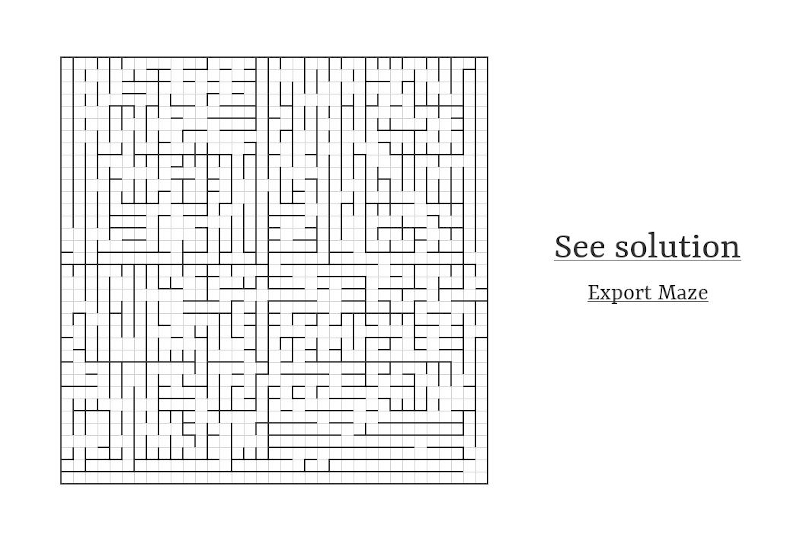

# Path-Finder

> A simple maze visualizer/solver in python built using [pygame](https://www.pygame.org/)

### How to Play
First, install pygame with the command 
    
    pip3 install pygame

To play, simply run 
  
    python3 play.py -n
    
where <b>n</b> is the size of the desired maze.
